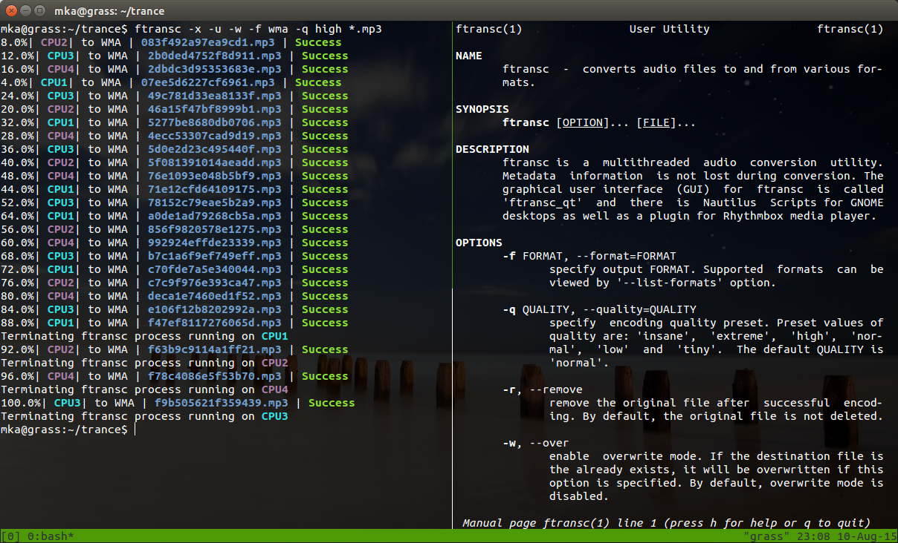
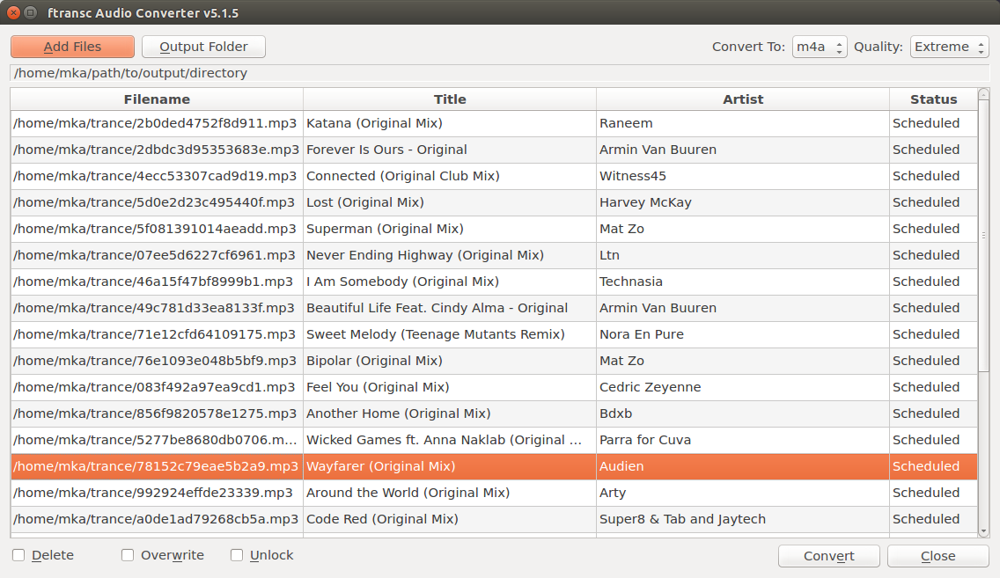
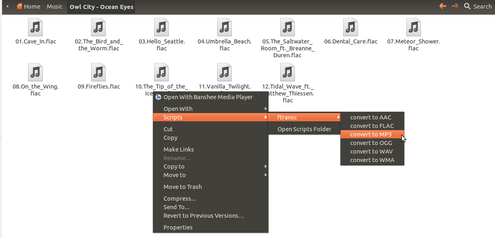
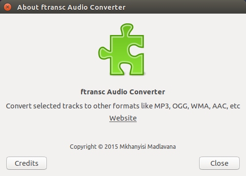
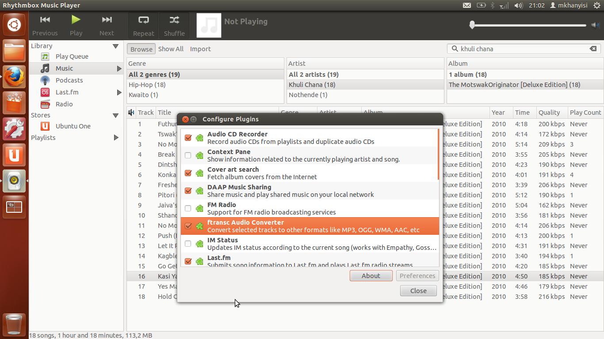
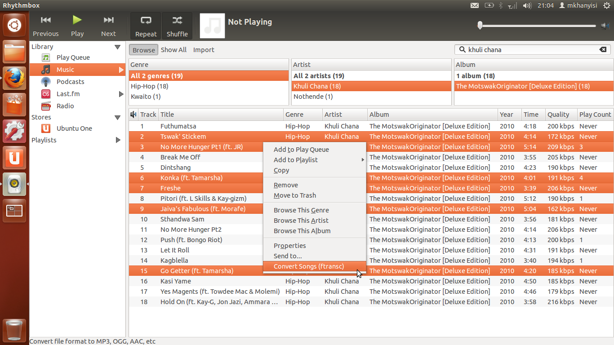

# What is ftransc

`ftransc` is the python audio conversion library for the Linux-based operating systems.

~~There is a GUI front-end to ftransc which is called `ftransc_qt`. ~~


## ftransc Dependencies 

The dependencies for ftransc are:
  * [Mutagen] (https://mutagen.readthedocs.org/) - for metadata handling
  * [FFMpeg] (http://www.ffmpeg.org) - for decoding all input multimedia files and encoding to  wma format.
  * [LAME] (http://lame.sourceforge.net) - for encoding to mp3 format.
  * [Flac] (http://flac.sourceforge.net) - for encoding to flac format.
  * [Vorbis Tools] (http://www.vorbis.com) - for encoding to ogg format.
  * [Faac] (http://www.audiocoding.com) - for encoding to aac format (with .m4a extension).
  * [Musepack] (http://www.musepack.net) - for encoding to musepack format (.mpc extension).
  * ~~[PyQt] (http://www.riverbankcomputing.co.uk/software/pyqt/intro) - for the GUI front-end, ftransc_qt.~~
  * [CD Paranoia] (http://www.xiph.org/paranoia) - for ripping CD digita audio.
  * [WavPack] (http://www.wavpack.com) - for encoding to WavPack format (.wv extension)


## Installing ftransc 6+

ftransc version 6 and above is available on PyPI and can be installed as follows:
```
    pip install ftransc
```

Similarly, `ftransc` can be uninstalled as follows:
```
    pip uninstall ftransc
```

Please note that `ftransc 6` is almost a complete rewrite and does not have all the `ftransc 5` features yet. 


## Installing ftransc 5

Ftransc versions older than version 6 can be installed as follows:

Install `ftransc`.
```
    git clone https://github.com/dopstar/ftransc.git
    cd ftransc
    git checkout ftransc_legacy
    sudo make uninstall
    sudo make install
```

If you already have ftransc of version 4.0.5 or higher and intend to upgrade to the lastest available version, you can use the --upgrade option of ftransc as follows.
```
    sudo ftransc --upgrade
```

Now you should be able to run ftransc from terminal. You use ftransc to check if the dependencies it needs are installed or not as follows:
```
    ftransc --check
```

For further ftransc help:
```
    man ftransc
    ftransc --help
```


## How ftransc Works

ftransc should be invoked/run on Terminal, typically in a syntax like `ftransc options files`. 
ftransc will convert one file at a time and followed by the next one, until all input files are converted.

(EDIT: ftransc version 5.0.0 and up supports multiprocessing so ftransc first put all the files to be converted on one single pool (queue). Then processes up to the number of available CPU cores are generated. Each process take a file from the queue and convert it. When it finishes it takes another file from the queue or terminates if the queue is empty.)

Conversion steps:

1. A lockfile corresponding to the input file is created, if it exists already, then the file is skipped because its already locked.
2. Then, the metadata tags are copied from the input file. See [#ftransc_Metadata_Tags](this) for a list of supported tags.
3. The input file is converted to the the desired audio format. The input file is not changed in any way. 
4. When the second step, above, has finised successfully, the metadata tags that were copied, if any, are then inserted into the newly created file.
5. A lockfile corresponding to the input file is deleted.
6. If an option to remove the original file is specified and if the conversion process has finished successfully, the original file is deleted.

Note: If step any of steps 2 to 4 has caused ftransc to terminate before reaching step 5, a lockfile will still exist. Further attempts to encode a file with a lockfile existing will cause that file to be skipped. To remove the lockfile use the '-u' option.


## ftransc Examples 

Example 1 - converting from MP3 to OGG:
```
    ftransc -f ogg filename.mp3
```
The output file name for the above example will be 'filename.ogg'

Example 2 - converting from MP3 to AAC, removing original file on success, using high quality preset:
```
    ftransc -r -q extreme -f aac filename.mp3
```

Example 3 - extract audio content from a video files into the MP3 format, use best quality preset:
```
    ftransc -q insane -f mp3 filename2.avi filename3.mpg filename4.vob ...
```

Example 4 - convert all audio files inside a given folder into WMA format. (This option is not recursive to child-folders)
```
    ftransc -f wma --directory /path/to/folder_name
```

Example 5 - convert all audio audio files (and extract all audio content from video files) inside a given folder recursively including all sub-/child-folders, ftransc should be used with the 'find' command in the pipeline as follows:
```
    find /path/to/folder_name -type f -print0 | xargs -0 ftransc -f aac -q high
```

## ftransc Quality Presets

ftransc uses quality presets called 'insane', 'extreme', 'high', 'normal', 'low', and 'tiny'. These presets are specified by the '-q' or '--quality' option of ftransc and are defined in the '/etc/ftransc/presets.conf' configuration file. 

The `/etc/ftransc/presets.conf` presets file can be overriden by use of the --presets option and specify the custom presets file to use or, if you know what you are doing, make changes directly on the it.


## ftransc Metadata Tags

The following is the list of supported tags across audio formats that ftransc can encode to. N means the tag is not supported and hence is lost during conversion. Y means the tag is supported and is present on the new file after conversion:

| *tag* | *m4a* | *mp3* | *ogg* | *flac* | *wma* | *mpc* | *wav* | *wv* |
|-------|-------|-------|-------|--------|-------|-------|-------|------|
| title | Y	| Y 	| Y 	| Y 	 | Y	 | Y 	 | N 	 | Y 	|
| artist | Y | Y | Y | Y | Y | Y | N | Y |
| album  | Y | Y | Y | Y | Y | Y | N | Y |
| genre  | Y | Y | Y | Y | Y | Y | N | Y |
| date   | Y | Y | Y | Y | Y | Y | N | Y |
| tracknumber | Y | Y | Y | Y | Y | Y | N | Y |
| composer    | Y | Y | Y | Y | Y | Y | N | N |
| publisher   | N | Y | N | N | Y | N | N | N |
| lyrics | Y | Y | N | N | Y | N | N | N |
| album art   | Y | Y | N | Y | N | N | N | N |
| album artist | N | N | N | N | N | N | N | N |
| comment     | N | N | N | N | N | N | N | N |

______

## Screenshots

The image below shows `ftransc` command in action on Terminal as well as the ftransc manpage (`man ftransc`):



_____

ftransc GUI front-end, *ftransc_qt*:



_____

ftransc also uses Nautilus Scripts, so you can right click selection of files and convert like:



_____

### ftransc plugin for Rhythmbox media player:

- The ftransc plugin for rhythmbox media player allows one to send files from Rhythmbox music player to ftransc for conversion.


____

- Enabling the plugin:


____

- Converting songs with ftransc from Rhythmbox



